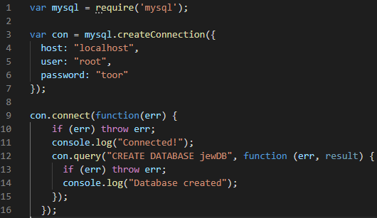
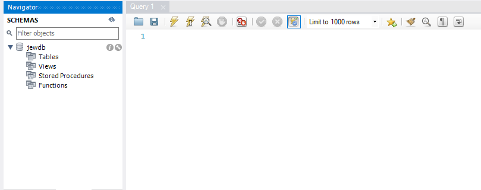
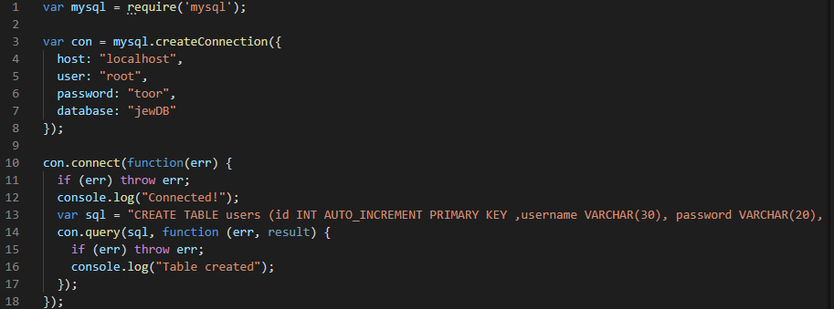
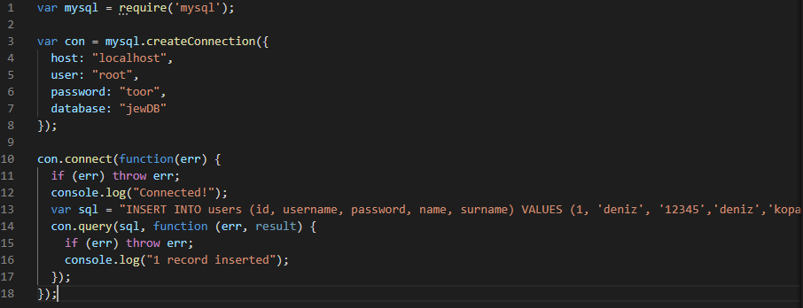

First I created a database named “jewDB” by executing following code.

After run that code we can see created database under mysql schemas.

Then, I added the table named “users” that includes a users’ informations.

Then, insert a user by running following code.

